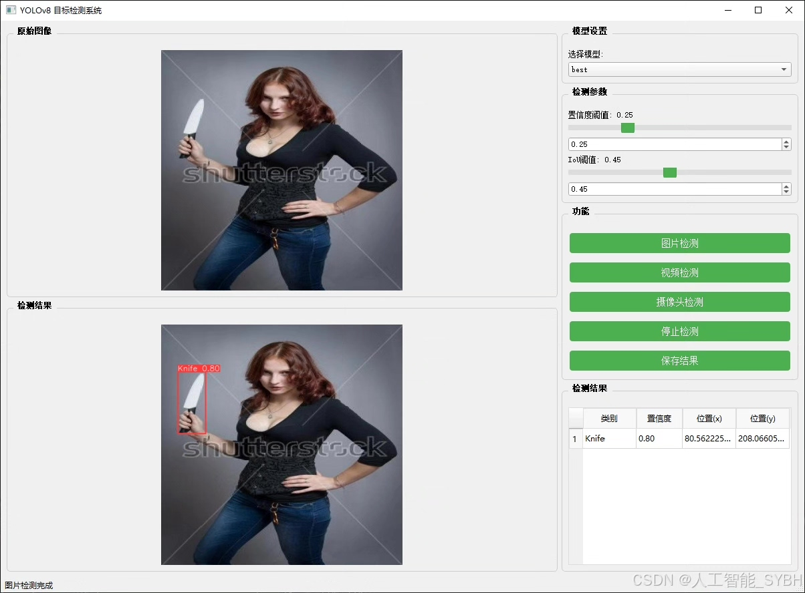
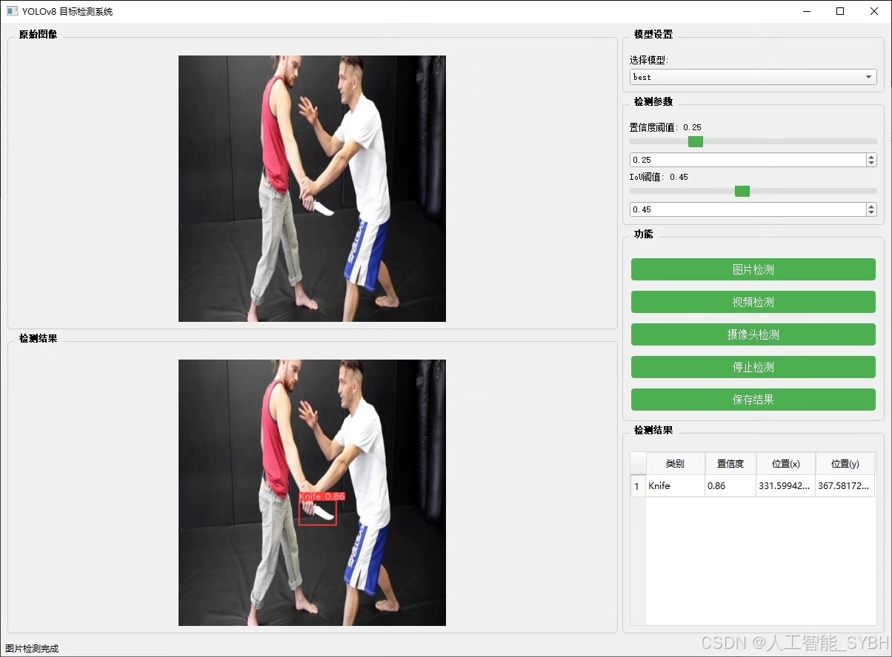
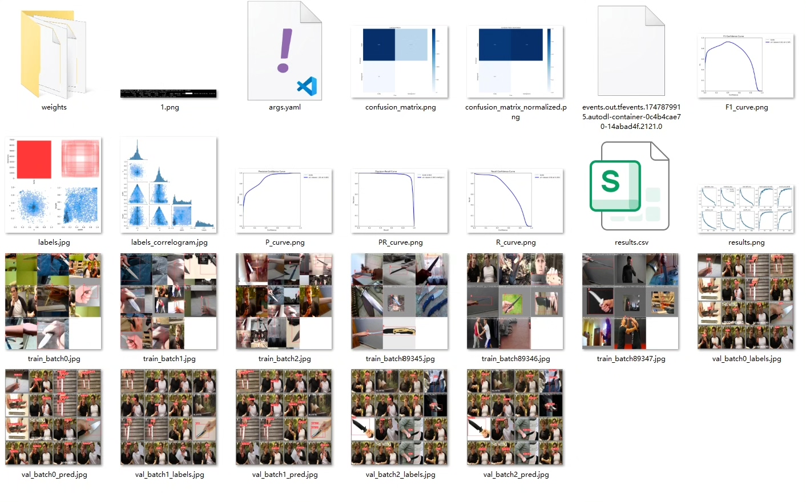
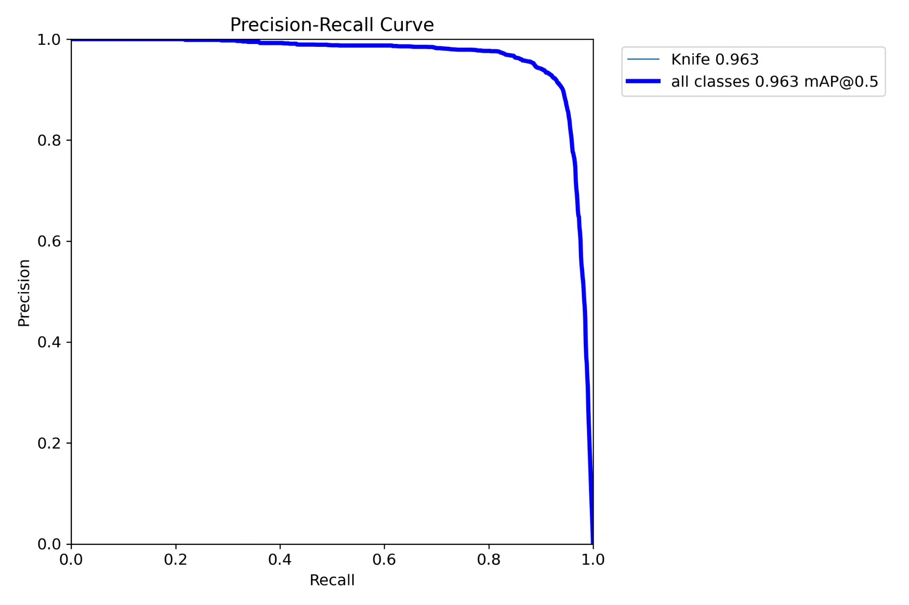
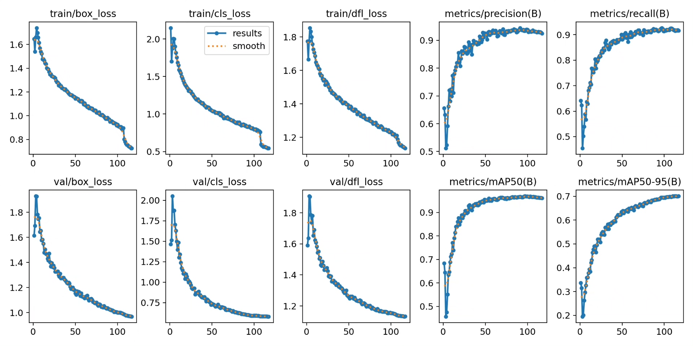
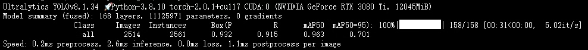
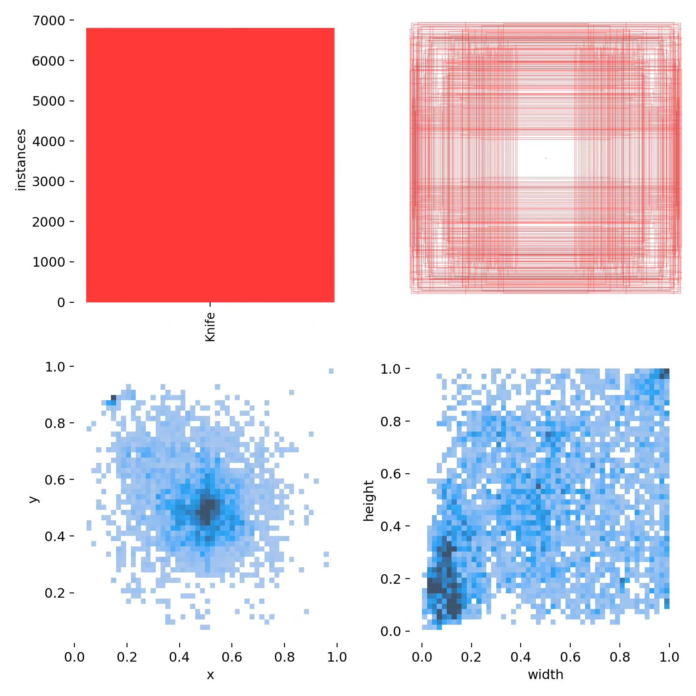
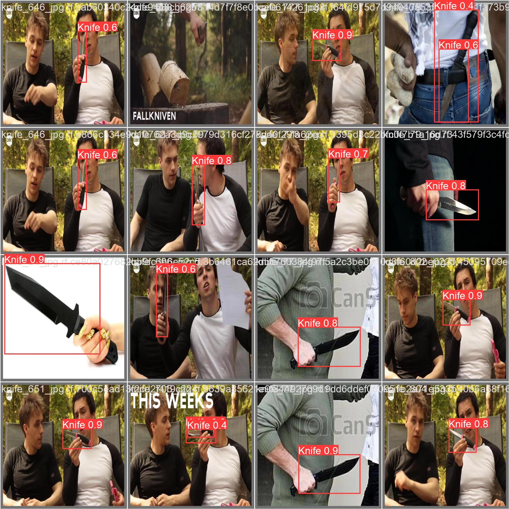

# Based on deep learning YOLOv8, a dangerous weapon identification detection system (YOLOv8)

## Body

Based on the YOLOv8 object detection algorithm, this project has developed a smart identification system for dangerous weapons (knives) in real-time monitoring scenes, aiming to enhance public safety and preventive capabilities. The system uses "Knife" as the only detection category, analyzing images or video streams through deep learning models to quickly and accurately identify and locate knives. It is suitable for security inspections, public places monitoring, campus safety, and other scenarios. The dataset includes 6675 training images and 2514 validation images. After data enhancement, model tuning, and transfer learning, the system maintains high detection accuracy and robustness even in complex environments. This solution can be integrated into security cameras, intelligent security checkpoints, drone patrols, etc., providing real-time warnings for safety protection and reducing the risk of violent incidents.

The company's products have obtained YOLO official commercial license certification.

We provide after-sales service.

After payment, we will provide WeChat ID for any questions.

Environmental configuration: We will provide an instruction manual for setting up the environment, and WeChat will provide answers to questions.

Remote installation service: If you need remote configuration, an additional fee of 69 is required, with all fees refunded if the configuration fails (only refund installation fees for older computers).

Retraining dataset: Once the environment is set up, you can train on your own computer. If you need us to retrain, just pay 69 plus computing power fees (2.5 yuan/hour).

Full after-sales service

## Images

## Payment

Here is a pay link on Stripe ( https://buy.stripe.com/3cs8yP7sY87d0vu9AB ). Please contact me lonlonago@foxmail.com after funding $89, and I will send you a complete data files , thank you!

